# Архитектура проекта "Геймификация жизни v0.2"

## Общая архитектура системы

Проект "Геймификация жизни" построен на основе клиент-серверной архитектуры с использованием современных технологий и подходов к разработке.

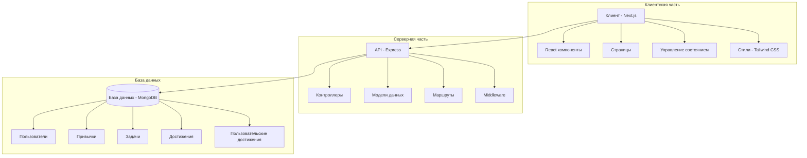

## Структура проекта

Проект организован как монорепозиторий с использованием workspaces в npm, что позволяет более гибко управлять зависимостями и обеспечивает удобную разработку как фронтенда, так и бэкенда.

```mermaid
graph TD
    Root[/habit-game/] --> PackageJson[package.json]
    Root --> Src[/src/]
    Root --> Docs[/docs/]
    Root --> Tests[/tests/]
    Root --> Config[Конфигурационные файлы]
    
    Src --> Frontend[/frontend/]
    Src --> Backend[/backend/]
    
    Frontend --> FComponents[/components/]
    Frontend --> FApp[/app/]
    Frontend --> FContexts[/contexts/]
    Frontend --> FHooks[/hooks/]
    Frontend --> FLib[/lib/]
    Frontend --> FPublic[/public/]
    Frontend --> FStyles[/styles/]
    Frontend --> FTypes[/types/]
    
    Backend --> BConfig[/config/]
    Backend --> BControllers[/controllers/]
    Backend --> BMiddleware[/middleware/]
    Backend --> BModels[/models/]
    Backend --> BRoutes[/routes/]
    Backend --> BServices[/services/]
    Backend --> BUtils[/utils/]
    Backend --> BTests[/tests/]
    
    Docs --> Architecture[architecture.md]
    Docs --> ApiDoc[api-documentation.md]
    Docs --> TestingStrategy[testing-strategy.md]
    Docs --> UiDesign[ui-design.md]
    Docs --> DataModels[data-models.md]
    Docs --> DevProcess[development-process.md]
    Docs --> TechStack[tech-stack.md]
    Docs --> CiCd[ci-cd.md]
    
    Config --> GitHubWorkflows[/.github/workflows/]
    Config --> Docker[Dockerfile]
    Config --> DockerCompose[docker-compose.yml]
    Config --> Jest[jest.config.js]
    Config --> Eslint[.eslintrc.js]
    Config --> Tsconfig[tsconfig.json]
```

## Архитектура фронтенда

Фронтенд построен на основе Next.js с использованием React и Tailwind CSS.

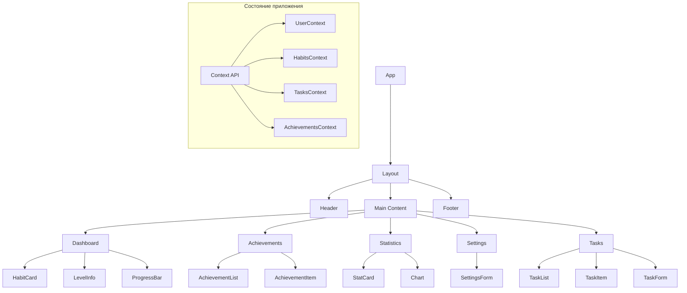

### Детальная структура фронтенда

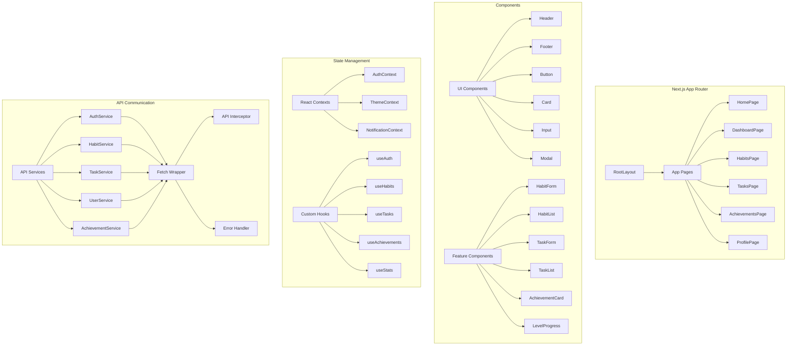

## Архитектура бэкенда

Бэкенд построен на основе Node.js и Express с использованием MongoDB в качестве базы данных.

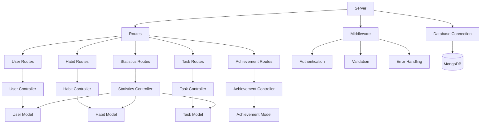

### Детальная структура бэкенда

```mermaid
graph TD
    subgraph Core Infrastructure
        App[Express App] --> ConfigLoader[Config Loader]
        App --> DatabaseConnector[Database Connector]
        App --> RoutesLoader[Routes Loader]
        App --> MiddlewareLoader[Middleware Loader]
        
        ConfigLoader --> EnvConfig[Environment Config]
        ConfigLoader --> LoggerConfig[Logger Config]
        
        DatabaseConnector --> MongooseConnection[Mongoose Connection]
        DatabaseConnector --> Seeder[Database Seeder]
    end
    
    subgraph API Layers
        RoutesLoader --> AuthRoutes[Auth Routes]
        RoutesLoader --> UserRoutes[User Routes]
        RoutesLoader --> HabitRoutes[Habit Routes]
        RoutesLoader --> TaskRoutes[Task Routes]
        RoutesLoader --> AchievementRoutes[Achievement Routes]
        
        AuthRoutes --> AuthController[Auth Controller]
        UserRoutes --> UserController[User Controller]
        HabitRoutes --> HabitController[Habit Controller]
        TaskRoutes --> TaskController[Task Controller]
        AchievementRoutes --> AchievementController[Achievement Controller]
        
        AuthController --> AuthService[Auth Service]
        UserController --> UserService[User Service]
        HabitController --> HabitService[Habit Service]
        TaskController --> TaskService[Task Service]
        AchievementController --> AchievementService[Achievement Service]
        
        AuthService --> UserModel[User Model]
        UserService --> UserModel
        HabitService --> HabitModel[Habit Model]
        TaskService --> TaskModel[Task Model]
        AchievementService --> AchievementModel[Achievement Model]
        AchievementService --> UserAchievementModel[UserAchievement Model]
    end
    
    subgraph Middleware
        MiddlewareLoader --> AuthMiddleware[Auth Middleware]
        MiddlewareLoader --> ErrorMiddleware[Error Middleware]
        MiddlewareLoader --> ValidationMiddleware[Validation Middleware]
        MiddlewareLoader --> LoggingMiddleware[Logging Middleware]
        
        AuthMiddleware --> JwtService[JWT Service]
        ValidationMiddleware --> JoiValidator[Joi Validator]
        LoggingMiddleware --> LoggerService[Logger Service]
    end
    
    subgraph Utilities
        JwtService --> Crypto[Crypto Utilities]
        LoggerService --> Winston[Winston Logger]
        
        Utils[Utilities] --> DateUtils[Date Utilities]
        Utils --> StringUtils[String Utilities]
        Utils --> ObjectUtils[Object Utilities]
    end
```

## Схема базы данных

База данных MongoDB содержит следующие коллекции:

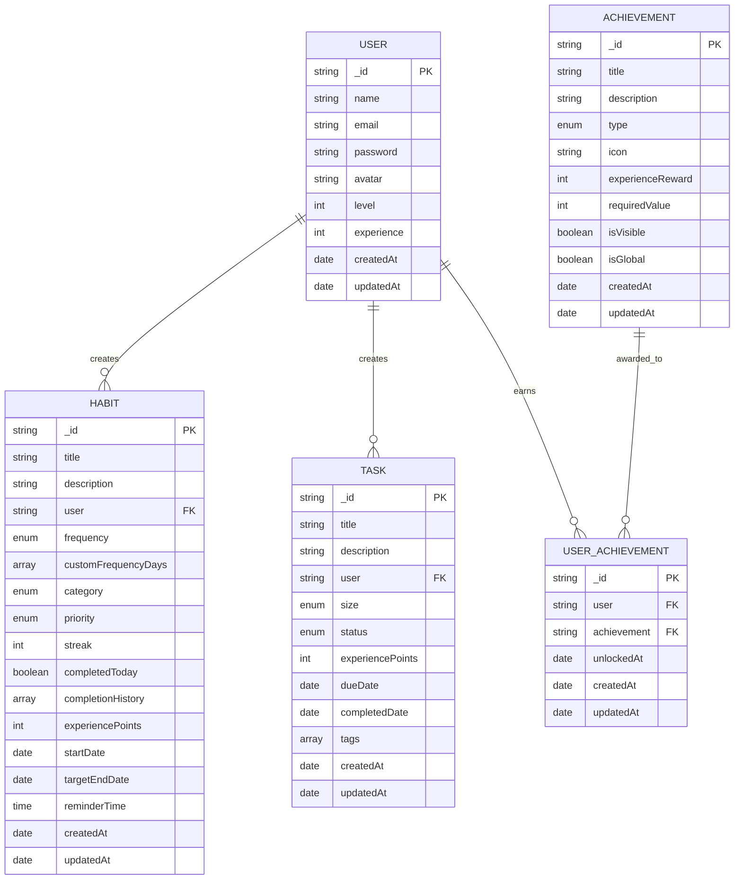

## Процесс аутентификации

Процесс аутентификации пользователя в системе:

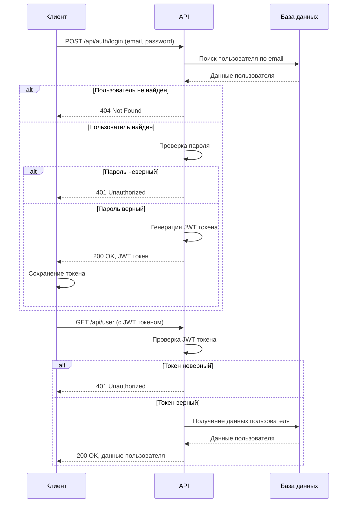

## Процесс выполнения привычки

Процесс отметки выполнения привычки и получения опыта:

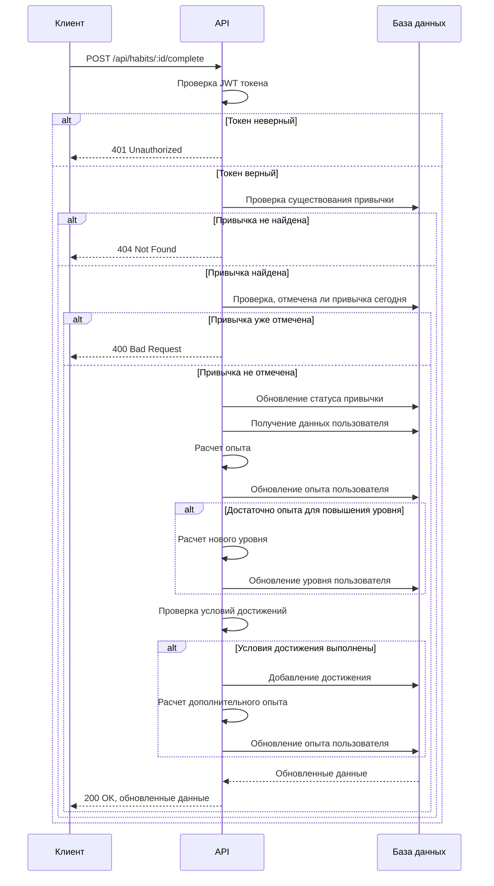

## Процесс получения достижения

Процесс получения достижения пользователем:

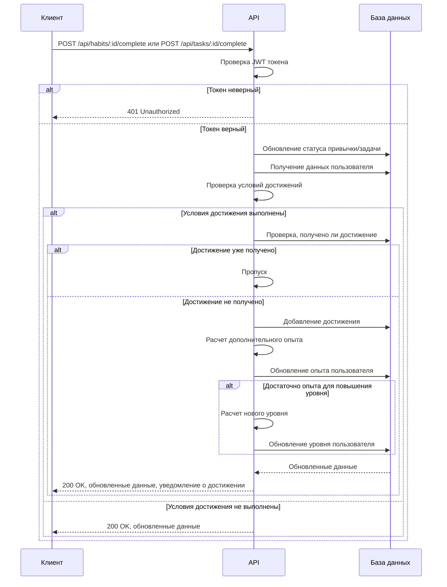

## Архитектура тестирования

Архитектура тестирования проекта:

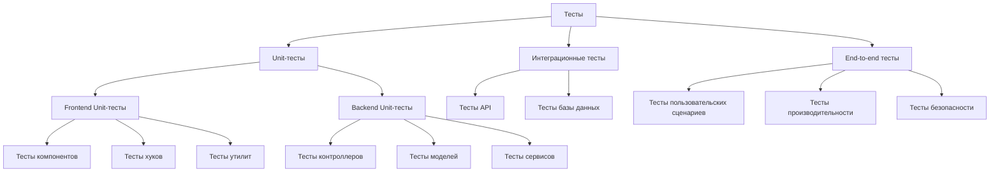

### Детальная архитектура TDD процесса

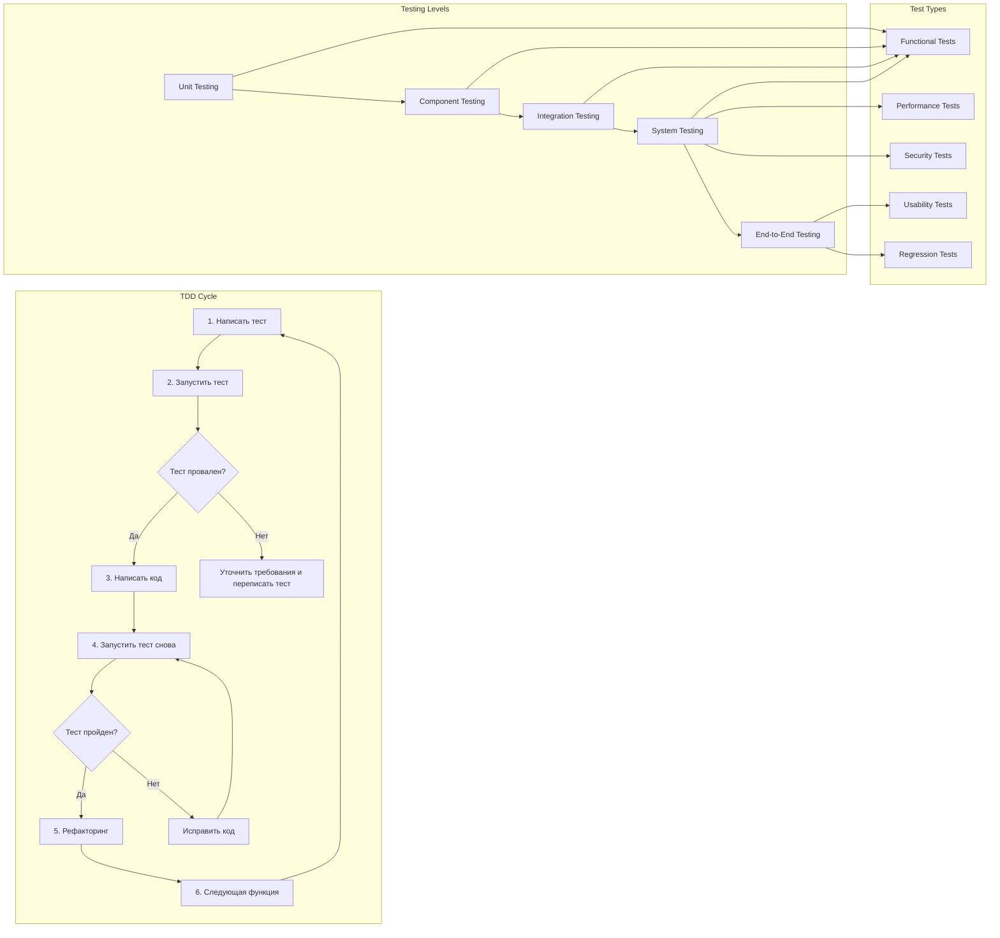

## Процесс CI/CD

Процесс непрерывной интеграции и доставки:

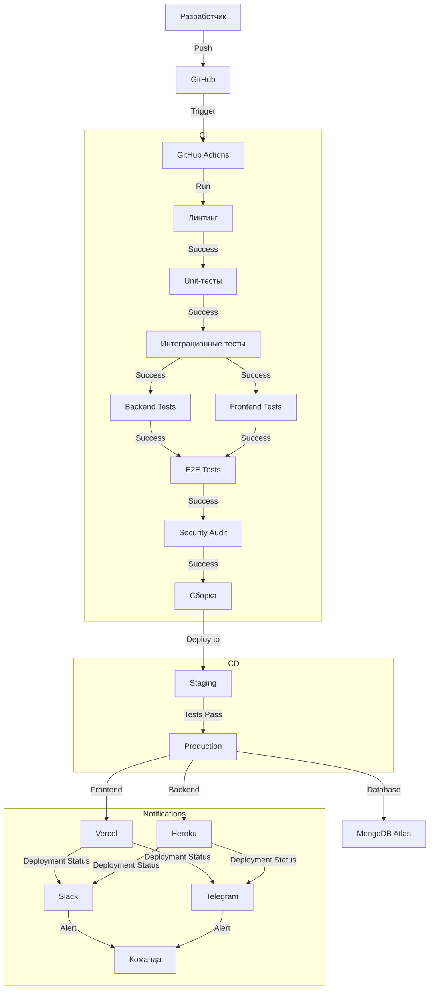

## Архитектура мониторинга

Архитектура мониторинга проекта:

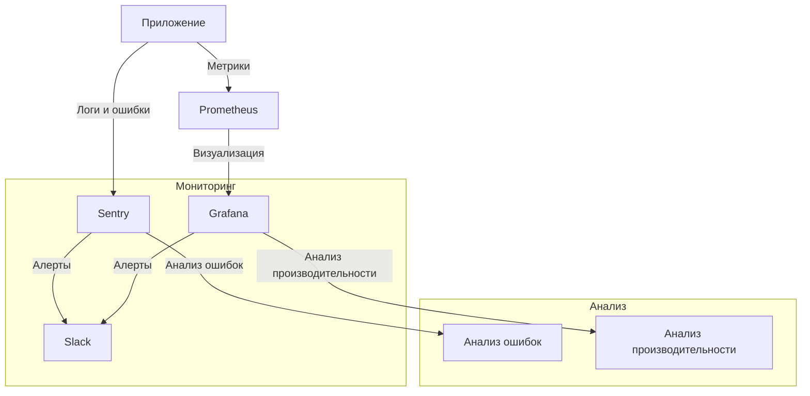

## Архитектура развертывания

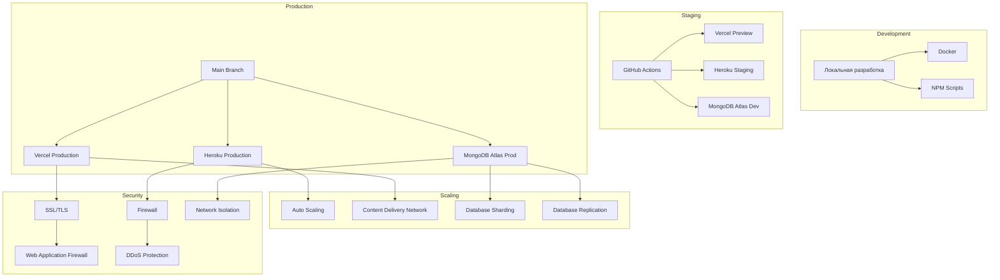