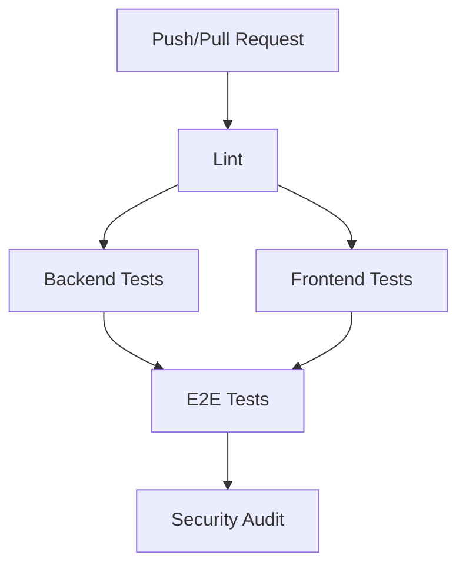
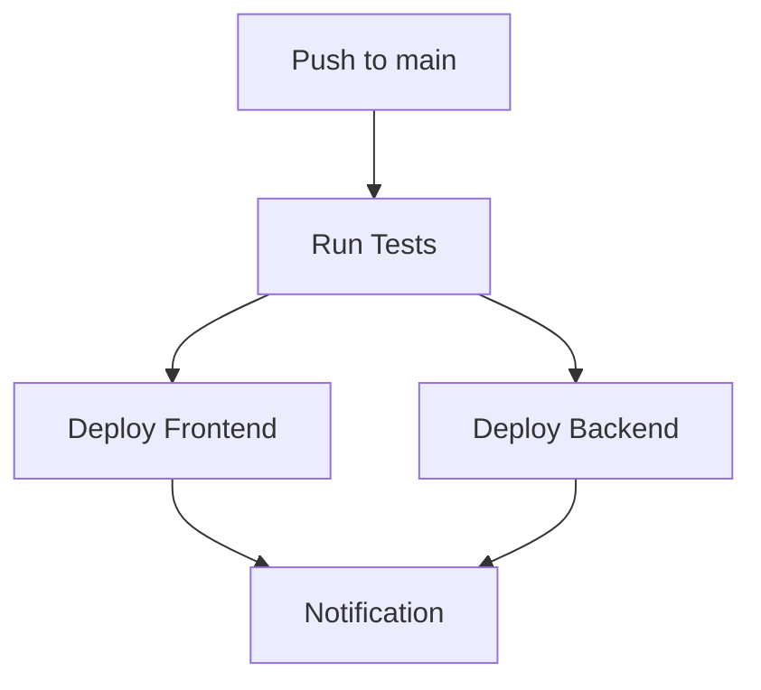

# CI/CD стратегия для проекта "Геймификация жизни"

В этом документе описана стратегия непрерывной интеграции (CI) и непрерывного развертывания (CD) для проекта "Геймификация жизни". Стратегия направлена на обеспечение качества кода, автоматизацию тестирования и развертывания.

## Общий обзор

Наша CI/CD стратегия базируется на GitHub Actions и состоит из двух основных компонентов:

1. **CI Pipeline** - запускается при каждом push в ветки `main` и `develop`, а также при создании Pull Request в эти ветки.
2. **CD Pipeline** - запускается только при push в ветку `main` или вручную через workflow_dispatch.

## CI Pipeline

CI Pipeline выполняет следующие шаги:



### Шаги CI Pipeline

1. **Lint** - проверка кода на соответствие стилям с помощью ESLint и Prettier.
2. **Backend Tests** - запуск модульных и интеграционных тестов для бэкенда, загрузка отчетов о покрытии кода.
3. **Frontend Tests** - запуск модульных и интеграционных тестов для фронтенда, загрузка отчетов о покрытии кода.
4. **E2E Tests** - запуск end-to-end тестов с использованием Cypress, проверка взаимодействия всех компонентов системы.
5. **Security Audit** - проверка зависимостей на наличие уязвимостей с помощью npm audit.

## CD Pipeline

CD Pipeline выполняет следующие шаги:



### Шаги CD Pipeline

1. **Run Tests** - запуск всех тестов (как в CI Pipeline) для подтверждения качества кода.
2. **Deploy Frontend** - сборка фронтенда и деплой на Vercel.
3. **Deploy Backend** - сборка бэкенда и деплой на Heroku.
4. **Notification** - отправка уведомлений о статусе деплоя в Slack и Telegram.

## Настройка CI/CD в GitHub Actions

### Файлы конфигурации

CI/CD настроен с помощью следующих файлов конфигурации GitHub Actions:

- `.github/workflows/ci.yml` - конфигурация CI pipeline
- `.github/workflows/cd.yml` - конфигурация CD pipeline

### Секреты

Для работы CD Pipeline необходимо настроить следующие секреты в GitHub:

#### Vercel (Frontend)
- `VERCEL_TOKEN`
- `VERCEL_ORG_ID`
- `VERCEL_PROJECT_ID`
- `NEXT_PUBLIC_API_URL`
- `VERCEL_URL`

#### Heroku (Backend)
- `HEROKU_API_KEY`
- `HEROKU_APP_NAME`
- `HEROKU_EMAIL`
- `HEROKU_APP_URL`
- `PORT`
- `MONGODB_URI`
- `JWT_SECRET`
- `JWT_EXPIRES_IN`

#### Инструменты анализа кода
- `CODECOV_TOKEN`
- `CYPRESS_RECORD_KEY`

#### Уведомления
- `SLACK_WEBHOOK`
- `TELEGRAM_TO`
- `TELEGRAM_TOKEN`

## Настройка локальной среды для тестирования

Для локального запуска тестов используйте следующие команды:

```bash
# Установка зависимостей
npm ci

# Запуск линтера
npm run lint

# Запуск всех тестов
npm test

# Запуск только unit-тестов
npm run test:unit

# Запуск только интеграционных тестов
npm run test:integration

# Запуск только e2e тестов
npm run test:e2e

# Запуск тестов с отчетом о покрытии
npm run test:coverage
```

## Мониторинг и метрики

CI/CD процесс включает мониторинг следующих метрик:

1. **Покрытие кода тестами** - отслеживается с помощью Codecov
2. **Время выполнения тестов** - отслеживается в GitHub Actions
3. **Успешность деплоя** - отслеживается и отправляется в уведомлениях
4. **Уязвимости зависимостей** - отслеживаются с помощью npm audit

## Стратегия веток и релизов

1. **main** - основная ветка, содержит стабильный код, готовый к релизу
2. **develop** - ветка разработки, содержит код для следующего релиза
3. **feature/** - ветки для разработки новых функций
4. **bugfix/** - ветки для исправления ошибок
5. **release/** - ветки для подготовки релиза

## Автоматизация релизов

Релизы автоматизированы с помощью GitHub Actions:

1. При merge в ветку `main` автоматически запускается CD Pipeline
2. Создаются теги версий с помощью семантического версионирования
3. Генерируются release notes на основе коммитов

## Заключение

Настроенная CI/CD стратегия обеспечивает:

1. **Качество кода** - через автоматическое тестирование и линтинг
2. **Быстрый цикл разработки** - через автоматизацию рутинных задач
3. **Стабильность релизов** - через последовательную проверку и деплой
4. **Прозрачность процесса** - через уведомления и метрики 